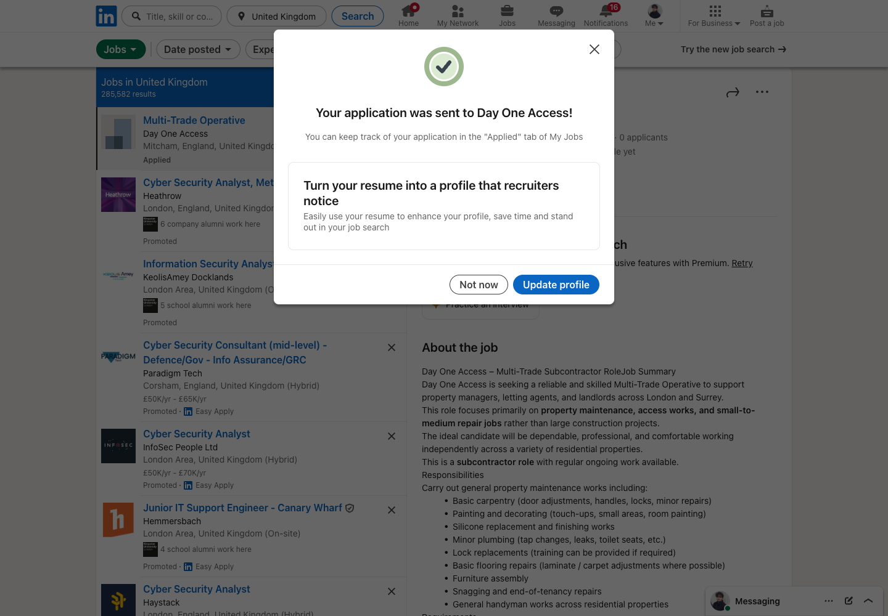
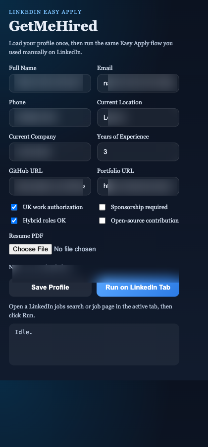

GetMeHired-LinkedIn Tool
Automate LinkedIn Easy Apply flows with saved profile details, a stored resume, and queue-based job processing.

Features
➤ Store your full name, email, phone, location, URLs, and job-preference flags in the popup.

➤ Upload a PDF resume and reuse it across LinkedIn applications.

➤ Queue Easy Apply jobs from LinkedIn search pages or apply to a single job view page.

➤ Fill common LinkedIn Easy Apply steps automatically, including contact fields, resume selection, yes/no questions, and numeric experience fields.

➤ Track already-submitted job IDs so the same role is not processed twice.

➤ Score and prioritize jobs against CV-style match keywords, then continue applying across results and pages until stopped.

Installation
Clone this repository to your local machine.

Open Chrome and navigate to chrome://extensions/.

Enable "Developer mode" (usually a toggle at the top right corner).

Click on "Load unpacked" and select the cloned repository folder.

Usage
Open Chrome and navigate to LinkedIn.

Click on the GetMeHired-LinkedIn extension icon in the browser toolbar to open the popup interface.

Enter your profile details and upload your PDF resume.

Open a LinkedIn jobs search page or job page in the active tab, then click "Run on LinkedIn Tab".

The extension continuously matches jobs against your CV keyword criteria, opens Easy Apply applications, fills common steps, and keeps running across pages.

Use "Stop" in the popup any time to halt the automation loop.

Communication and Behavior
The content script owns the LinkedIn workflow and resumes automatically across job-page navigations.

The background script stores extension state and profile settings.

The popup persists profile data and resume uploads to `chrome.storage.local`.

Applied job IDs are tracked so the same role is skipped on later runs.

Screenshots (Sensitive Data Blurred)
Below are live runtime screenshots with sensitive data intentionally blurred.

Caption: LinkedIn jobs search/results page after an Easy Apply submission.

Caption: GetMeHired popup opened from the toolbar, showing saved profile controls with blurred personal fields.

Caption: LinkedIn Easy Apply modal stage with sensitive content blurred.

Contact
For inquiries or issues, feel free to contact us at your@email.com.

License
This project is licensed under the MIT License.